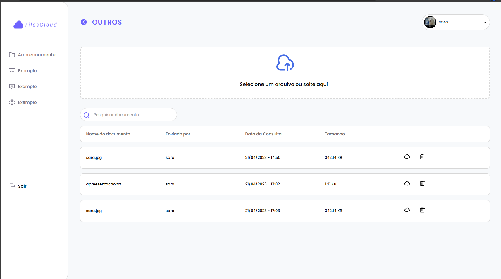

<h2  align="center">

</h2>
# Node API REST - Toxicological Report

  
## About
Back-end for testing and listing toxicological exams, where it is possible to pass the results and receive the test whether it was positive or negative

## How to run for development


1. Clone this repository
```bash
git clone https://github.com/sararchh/filesCloud.git
```
2. Install all dependencies
```bash
npm i
```
1. Configure the `.env.development` or `.env.` file using the `.env.example` file
   
```bash
PORT=4000
NODE_ENV=development

TZ=America/Sao_Paulo

JWT_SECRET=
JWT_REFRESH_SECRET=

DB_PORT=3306

DB_HOST=
DB_NAME=
DB_USER=
DB_PASS=

#AWS-bucket
ID_BUCKET=
SECRET_BUCKET=
NAME_BUCKET=
URL_BUCKET=
```

## Building and starting for production or development
  
```bash
npm run  build
npm start
```

```bash
npm run  build
npm dev
```


## Routes
```
http://localhost:4000/docs
```


<p  align="center">Made with 💜 by <a  href="https://github.com/sararchh"  target="_blank">Sara Rocha</a></p>